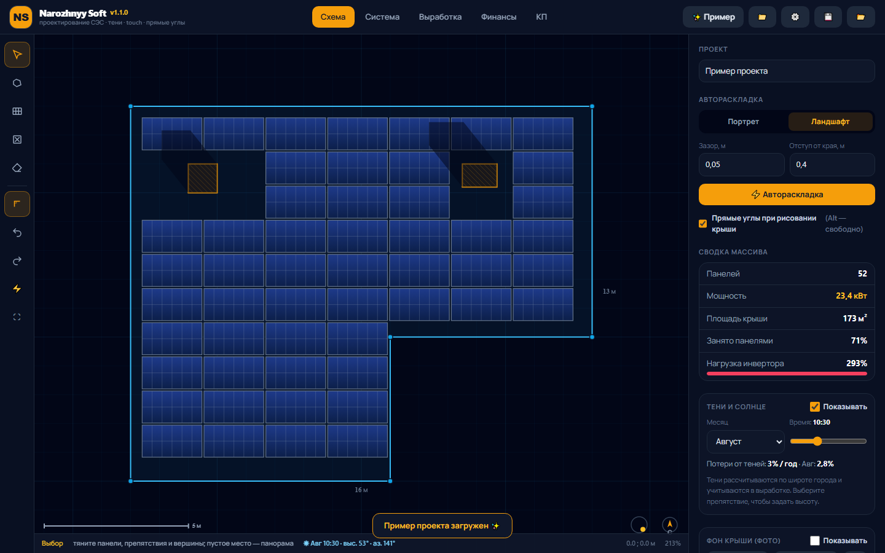
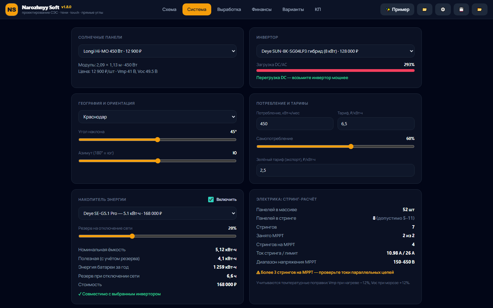
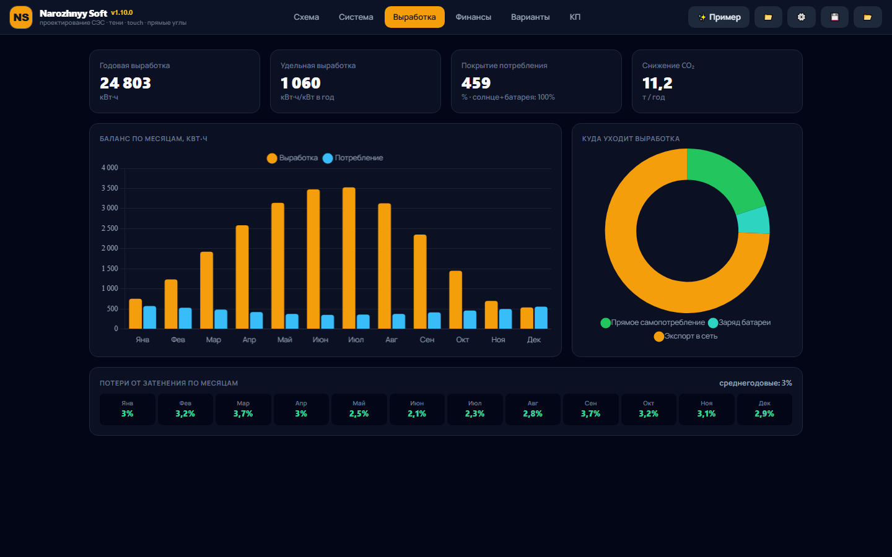
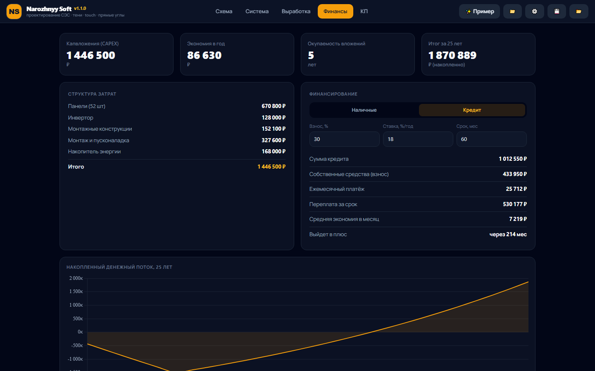
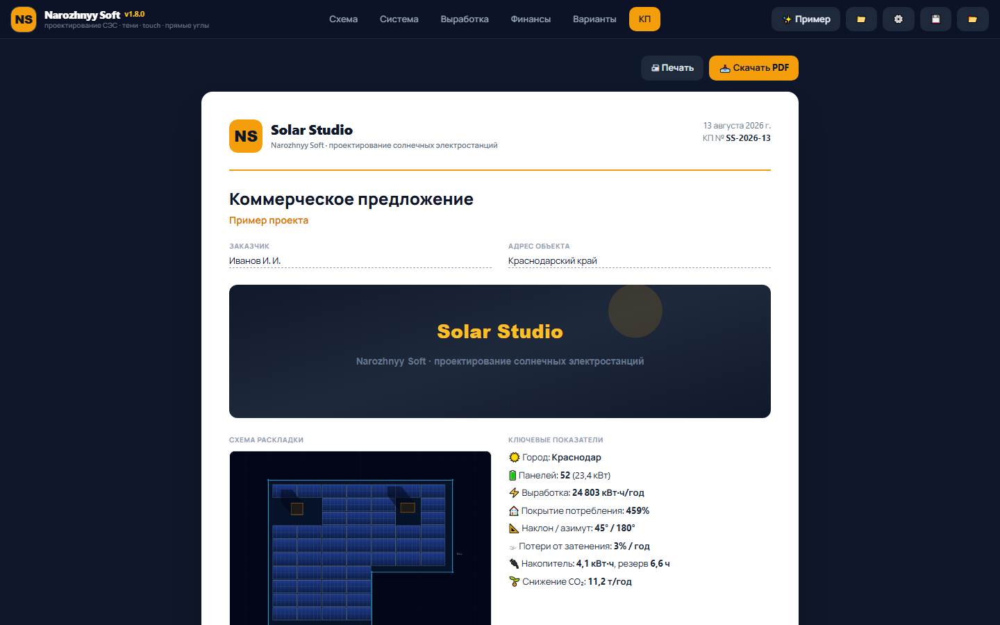
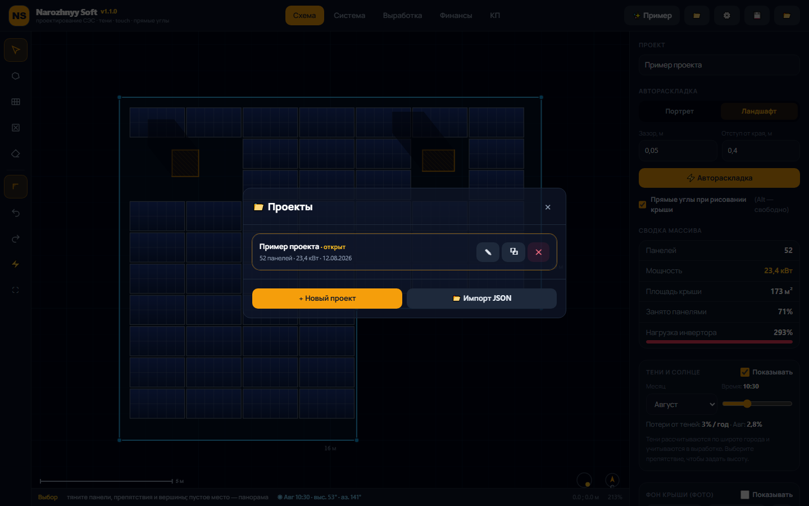

<div align="center">


# Solar Studio

**Проектирование солнечных электростанций — прямо с телефона**

Офлайн-приложение для Android: чертите крышу на канвасе, раскладываете панели, считаете тени, выработку, финансы и мгновенно получаете коммерческое предложение для клиента.

[⬇️ Скачать APK](https://github.com/JopaName/narozhnyy-soft/releases/latest/download/SolarStudio.apk)
· [📦 Все версии](https://github.com/JopaName/narozhnyy-soft/releases)

</div>

---

## 📱 Что умеет

| Возможность | Описание |
|---|---|
| 🏠 **Канвас-редактор крыши** | Рисуйте контур касаниями: прямые углы ⊥, размеры, зум двумя пальцами |
| 📷 **Обводка по фото** | Загрузите фото/план крыши фоном, откалибруйте масштаб по известной длине — и обводите контур прямо по картинке |
| 📁 **Несколько проектов** | Список проектов: создание, переименование, дублирование, удаление — всё хранится локально |
| ⚡ **Автораскладка панелей** | Портрет/ландшафт, зазоры, отступы — панели встают сами, можно править руками |
| 🌑 **Тени по солнцу** | Расчёт затенения по широте города, месяцу и времени — учитывается в выработке |
| 🔧 **Подбор оборудования** | Панели, инверторы (DC/AC, MPPT), гибриды и батареи — с проверкой стрингов |
| ☀️ **Выработка** | Погодовая генерация, баланс по месяцам, покрытие потребления, CO₂ |
| 💰 **Финансы** | CAPEX, окупаемость, кредит или наличные, денежный поток на 25 лет |
| 📄 **КП за секунды** | Коммерческое предложение: спецификация, выработка, финансы + экспорт в PDF |
| 🛠 **Свой каталог** | Редактор оборудования прямо в приложении — цены и модели без пересборки |
| 🔄 **Автообновления** | Приложение само проверяет новые версии и предлагает скачать обновление |
| 📴 **Полностью офлайн** | Никакого интернета после установки — всё внутри APK |

## 🖼 Скриншоты

<div align="center">
  
  
  
  
  
  
</div>

## 📥 Установка на Android

1. Скачайте [`SolarStudio.apk`](https://github.com/JopaName/narozhnyy-soft/releases/latest/download/SolarStudio.apk)
2. Откройте файл на телефоне
3. Разрешите установку из неизвестных источников
4. Иконка **Solar Studio** появится на рабочем столе — приложение работает без интернета

## 🛠 Для разработчиков

```bash
# Установка зависимостей
npm install

# Демо-сервер с горячей перезагрузкой (http://localhost:5173)
npm run dev

# Тесты
npm run test:unit   # 71 unit-тест (Vitest)
npm run test:e2e    # 19 e2e-тестов (Playwright)

# Сборка APK (нужны JDK 21 и Android SDK)
npm run android:build
```

**Стек:** TypeScript · Vite · Tailwind CSS · Chart.js · Capacitor (Android)

**Версия приложения:** `src/core/version.ts` · **Каталог оборудования:** `public/equipment.json`

## 📝 Лицензия

MIT — используйте свободно, упоминание автора приветствуется.
